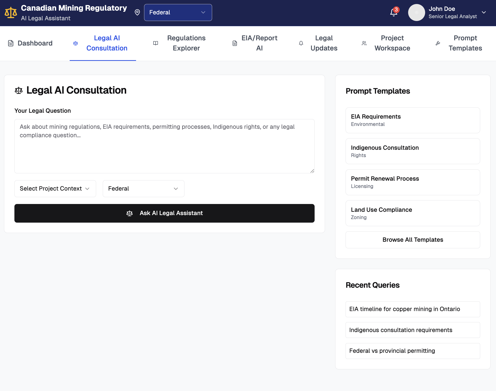
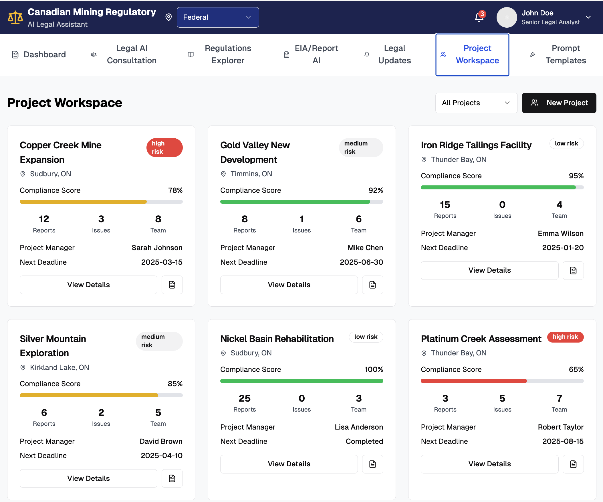
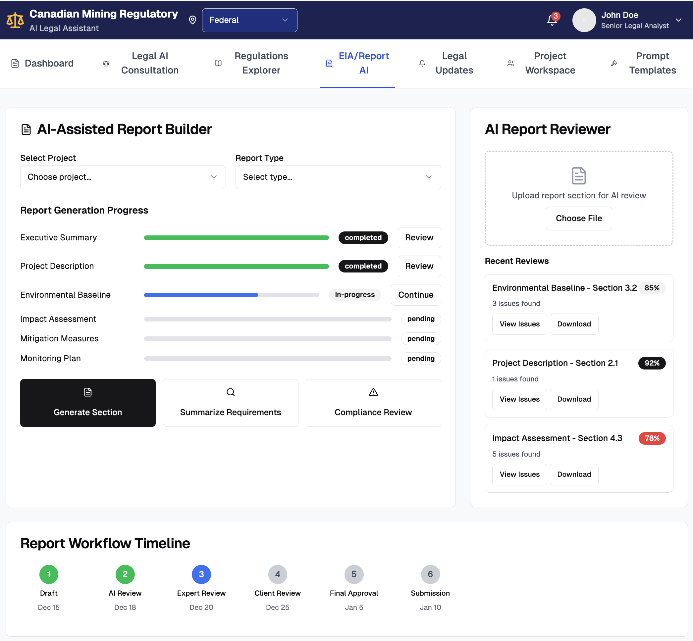
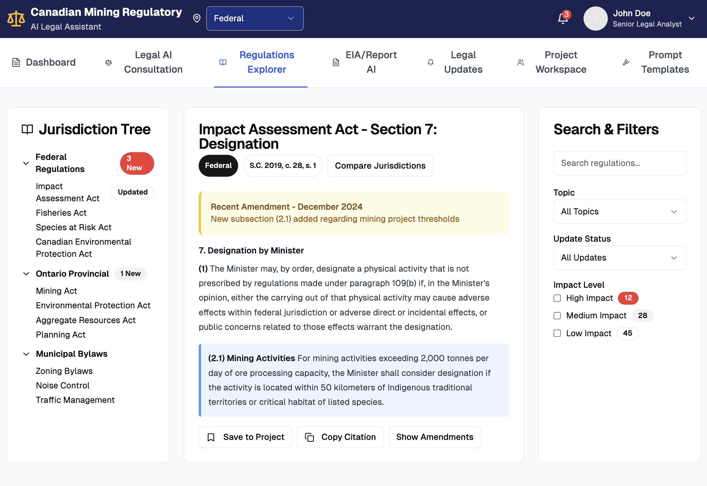
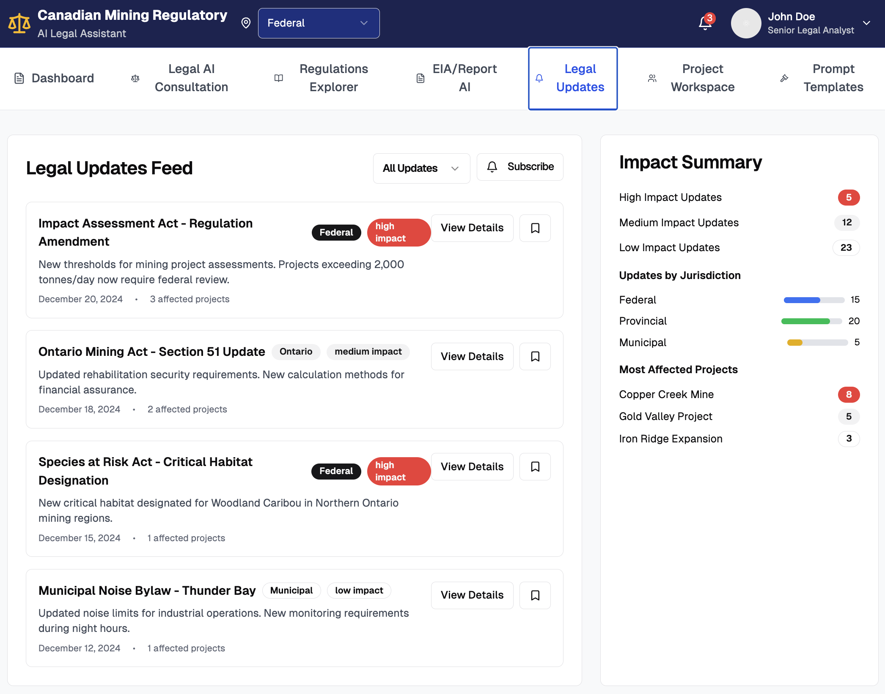
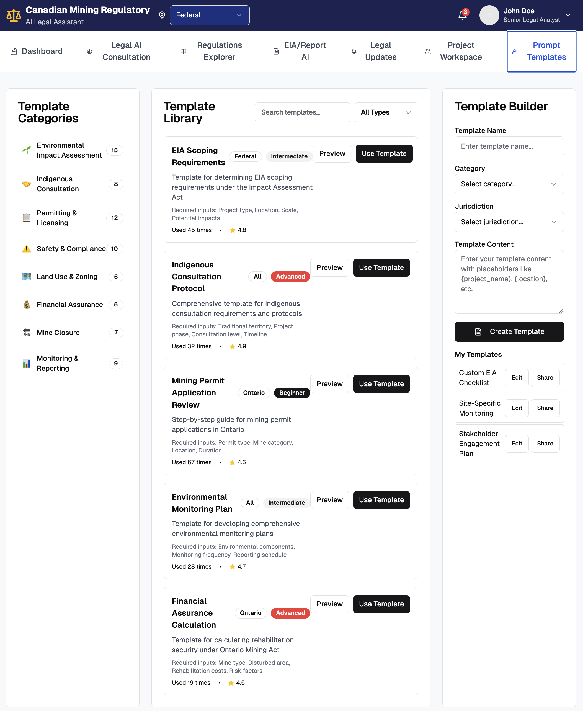
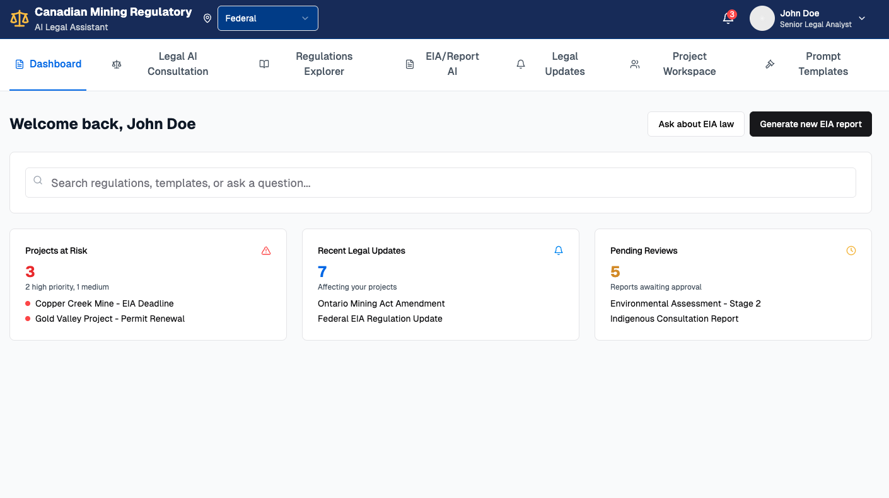
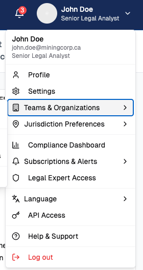

# Canadian Mining Regulatory 系统功能文档

[1 项目基础架构与部署](#1-项目基础架构与部署)
[2 用户身份与权限管理](#2-用户身份与权限管理)
[3 法律法规数据采集与入库](#3-法律法规数据采集与入库)
[4 法规知识向量化与存储](#4-法规知识向量化与存储)
[5 法规智能问答系统（Legal AI Consultation）](#5-法规智能问答系统legal-ai-consultation)
[6 项目管理模块（Project Workspace）](#6-项目管理模块project-workspace)
[7 可研报告生成模块（EIA / Report AI）](#7-可研报告生成模块eia--report-ai)
[8 法规浏览与更新比对模块（Regulations Explorer）](#8-法规浏览与更新比对模块regulations-explorer)
[9 Prompt模板与插件系统（Prompt Templates & Plugins）](#9-prompt-模板与插件系统prompt-templates--plugins)
[10 Dashboard（仪表盘总览）](#10-dashboard仪表盘总览)
[11 系统管理与监控模块（System Admin & Monitoring）](#11-系统管理与监控模块system-admin--monitoring)
[12 用户功能与团队组织管理](#12-用户功能与团队组织管理)

---

## 1 项目基础架构与部署

> 目标：构建一个可扩展、可持续迭代、支持向量化与AI问答的法规合规平台基础架构，覆盖前后端、数据库、部署、安全、CI/CD 全流程。

### 1.1 技术选型与架构设计

#### 1.1.1 前端架构设计
- [ ] **选择前端技术栈**：使用 Next.js 框架结合 Tailwind CSS 与 ShadCN UI，支持 SSR、组件化开发与快速迭代。
- [ ] **规划前端路由结构**：定义核心页面如 /dashboard、/projects、/legal-ai，配合 App Router 实现模块化加载。
- [ ] **统一状态管理方案**：采用 Zustand 管理登录状态、用户信息、项目上下文等全局状态。
- [ ] **封装 API 请求模块**：统一封装 fetch 请求逻辑，支持 Token 注入、错误处理与自动重试。

#### 1.1.2 后端架构设计
- [ ] **确定后端框架技术**：选择 Node.js + Fastify 或 Python + FastAPI 实现轻量级 REST API 服务。
- [ ] **定义接口命名与模块划分**：规划接口路径如 /api/auth, /api/projects, /api/ai，按功能分层组织。
- [ ] **配置统一响应与错误中间件**：统一接口返回结构为 { code, message, data }，支持异常捕获与状态码规范化。

#### 1.1.3 数据库架构设计
- [ ] **设计核心数据表结构**：定义用户、组织、项目、法规、报告等数据表及其关联外键。
- [ ] **配置 ORM 工具**：选用 Prisma（Node）或 SQLAlchemy（Python）进行 schema 建模与迁移控制。
- [ ] **接入文档存储方案**：使用 GCS / S3 存储原始法规文件、报告文档等非结构化数据。

#### 1.1.4 向量库与 AI 模型架构
- [ ] **选型向量数据库与嵌入模型**：初期使用 FAISS 本地部署，正式环境迁移至 Qdrant 或 Weaviate；嵌入模型选用 OpenAI / BGE。
- [ ] **搭建法规文档向量化处理模块**：通过 LangChain 实现法规文档加载、分块、嵌入、索引入库。
- [ ] **封装 LLM 接口统一管理模块**：支持配置与切换 OpenAI、Claude、Gemini 等模型提供商接口。

---

### 1.2 开发环境配置

#### 1.2.1 Monorepo 初始化
- [ ] **使用 Turborepo 管理前后端子项目**：项目结构包含 frontend, backend, ai, shared 等子目录，集中管理开发脚本。
- [ ] **统一环境变量配置方式**：使用 dotenv 加载 .env 文件，结合 schema 校验确保关键变量存在。
- [ ] **配置 mock 接口用于前端独立开发**：提供通用 auth, user, project 的本地模拟响应，便于前后端并行开发。
- [ ] **集成本地调试工具与接口测试平台**：配置 Swagger UI / Redoc 展示接口文档，Postman Collection 管理调试脚本。

---

### 1.3 CI/CD 自动部署流程

#### 1.3.1 自动化部署与预览环境
- [ ] **配置 GitHub Actions 工作流**：设定每次 push/pull request 触发构建流程，包含 build + test + lint。
- [ ] **配置 Vercel 自动部署前端**：通过 GitHub 分支自动部署 preview 与 production 环境。
- [ ] **后端服务部署至 Railway / Cloud Run**：根据分支策略区分测试与正式部署，集成日志与运行状态监控。

#### 1.3.2 自动化检查与发布通知
- [ ] **配置 Lint/格式化/类型检查钩子**：集成 ESLint, Prettier, TypeScript 检查，并作为 CI 阶段阻断条件。
- [ ] **构建完成后推送发布通知**：通过 GitHub Actions + Slack / 邮件通知团队更新状态与构建版本。

---

### 1.4 云部署架构配置

#### 1.4.1 云服务配置
- [ ] **搭建前端 CDN 分发系统**：Vercel 内建 CDN 部署 Next.js 项目，支持 ISR 与边缘计算。
- [ ] **部署后端 API 服务**：使用 Railway / Supabase Function / Cloud Run 等 Serverless 服务运行后端逻辑。
- [ ] **创建法规文档存储桶**：在 GCS / AWS S3 中开设专属 Bucket，供法规原文上传存档。

#### 1.4.2 向量数据库部署
- [ ] **在开发环境部署 FAISS 服务**：通过 Python 模块在本地持久化存储法规向量索引。
- [ ] **在正式环境使用 Qdrant / Weaviate 部署**：部署 Docker 版本，支持 REST API 检索、Tag 查询与权限分层。

---

### 1.5 安全策略与访问控制

#### 1.5.1 接口访问控制
- [ ] **使用 JWT 实现用户鉴权**：登录后颁发 access_token，前端所有请求需带 Token 访问受保护资源。
- [ ] **设置 API 路由权限策略**：基于角色区分接口访问（访客、注册用户、管理员），限制操作范围。
- [ ] **配置全局 CORS 策略与速率限制**：禁止跨域访问敏感接口，防止接口被刷爆。

#### 1.5.2 密钥管理与监控
- [ ] **在环境配置中保护敏感变量**：所有 API 密钥、数据库 URI 等信息使用 Secret Store 管理，不写入代码库。
- [ ] **添加 Git Hook 防止密钥提交**：设置 pre-commit 检测敏感字段提交，防止 .env 泄露。
- [ ] **记录安全访问日志与操作审计**：记录每个用户的 API 访问时间、路径、状态码，供安全分析与追踪。


---

## 2 用户身份与权限管理

> 目标：为平台提供安全、灵活的多种用户登录方式、组织/团队管理机制和基于角色的权限控制体系。

### 2.1 邮箱注册与登录

#### 2.1.1 用户邮箱注册
- [ ] **实现邮箱注册接口**：用户输入邮箱、密码、昵称，后端验证并保存用户信息（加密密码）。
- [ ] **实现邮箱验证机制**：注册后发送激活邮件，点击激活链接后标记账户已验证。
- [ ] **实现邮箱重复检测**：注册前校验邮箱唯一性，防止重复注册。

#### 2.1.2 邮箱登录
- [ ] **实现用户登录接口**：输入邮箱与密码，验证身份后签发 JWT Token。
- [ ] **实现登录失败限制**：设定连续登录失败次数上限（如 5 次）并锁定一段时间。
- [ ] **记录登录日志信息**：记录 IP 地址、时间、设备信息，用于审计和安全分析。

#### 2.1.3 忘记密码 / 重置密码
- [ ] **实现重置请求流程**：用户提交邮箱后发送验证码或重置链接。
- [ ] **验证重置令牌有效性**：检查重置链接是否过期、是否匹配当前用户。
- [ ] **重置密码更新逻辑**：输入新密码后更新账户记录并通知用户成功。

---

### 2.2 Google OAuth 登录

#### 2.2.1 接入 Google 登录
- [ ] **配置 Google OAuth 应用信息**：注册 Client ID、Secret，配置回调 URI。
- [ ] **接入 OAuth 授权流程**：引导用户跳转 Google 授权页面并获取用户信息。
- [ ] **解析 Google 返回信息并注册/登录用户**：首次登录自动创建用户记录，后续登录直接签发 Token。

#### 2.2.2 OAuth 账户绑定（可选）
- [ ] **支持邮箱注册用户绑定 Google 登录**：登录后用户可将 Google 账号关联已有账户。
- [ ] **处理冲突逻辑**：如果 Google 邮箱已被注册，则提示用户绑定或合并。
- [ ] **支持解绑 OAuth 方式**：用户可撤销 Google 登录绑定，仅保留邮箱密码登录。

---

### 2.3 用户资料与偏好设置

#### 2.3.1 个人资料管理
- [ ] **实现用户信息读取与更新接口**：支持用户更新昵称、头像、手机号、语言偏好。
- [ ] **头像上传功能**：接入 GCS / S3 上传用户头像文件，生成访问链接。
- [ ] **更新 UI 偏好配置**：如默认暗色模式、语言（中/英/法）等个性化设置。

---

### 2.4 组织与团队系统

#### 2.4.1 组织与团队模型设计
- [ ] **设计组织、团队、用户关系结构**：用户可属于多个组织，每个组织可含多个团队。
- [ ] **配置组织表结构**：组织包含 ID、名称、域名、Logo、订阅配置等信息。
- [ ] **配置团队表结构**：团队绑定于组织下，支持分配成员与项目。

#### 2.4.2 团队管理功能
- [ ] **实现团队创建与成员邀请**：组织管理员可新建团队并通过邮箱邀请成员加入。
- [ ] **支持成员加入申请与审批流程**：用户可申请加入特定组织/团队，管理员审批。
- [ ] **支持成员角色修改与移除**：组织/团队管理员可调整成员权限或移除成员。

---

### 2.5 角色权限控制（RBAC）

#### 2.5.1 角色模型与权限定义
- [ ] **定义系统角色与权限点**：如 guest、member、org_admin、platform_admin。
- [ ] **制定权限规则映射表**：权限点如 can_create_project, can_generate_report, can_invite_user。
- [ ] **支持权限多级继承**：平台权限 > 组织权限 > 项目权限，逐级校验。

#### 2.5.2 权限中间件与访问控制
- [ ] **配置 API 访问拦截器**：后端接口根据 Token 中的角色判定是否允许访问。
- [ ] **封装前端权限判定工具**：根据用户角色动态显示/隐藏按钮、菜单与页面。
- [ ] **提供权限不足提示机制**：访问受限资源时给出错误码与友好提示信息。

---

### 2.6 安全日志与账户行为监控

#### 2.6.1 登录日志记录
- [ ] **记录登录时间、IP、设备信息**：每次登录写入 login_log 表，支持后期审计。
- [ ] **可视化用户登录轨迹（可选）**：后台展示最近登录地点、时间、IP 变化等。

#### 2.6.2 异常登录检测与提醒（可选）
- [ ] **检测跨地域/频繁登录行为**：发现异常时触发提醒或强制验证。
- [ ] **发送安全通知邮件/站内信**：如登录地变化、被强制退出等情况立即提醒用户。

---

## 3 法律法规数据采集与入库

> 目标：构建自动化法规采集系统，持续获取加拿大联邦、省级、市政矿业相关法规，并完成结构化存储、语义分块与入库，为向量化与问答系统提供数据基础。
> 该模块可接入向量化与问答模块，作为后续 LangChain 向量生成与 RAG 查询的上游数据入口。

### 3.1 法规来源与采集框架搭建

#### 3.1.1 制定法规来源清单
- [ ] **汇总法规发布网站列表**：整理包括 Canada.ca、Justice Laws、IAAC、Ontario e-Laws 等可公开访问的法规来源网址。
- [ ] **记录各网站的结构与分页机制**：识别站点的法规索引页结构、分页方式、更新频率等信息。
- [ ] **维护法规来源元数据表**：每个来源记录 URL、法域、省份、更新时间策略等，用于后续爬虫调度。

#### 3.1.2 构建法规爬虫框架
- [ ] **初始化通用爬虫架构**：使用 Scrapy 或 Playwright 实现 HTML/PDF/链接抓取统一接口。
- [ ] **添加动态渲染与翻页处理逻辑**：支持加载 JS 渲染内容与“下一页”/“展开全文”等操作。
- [ ] **集成失败重试与异常捕获机制**：网络失败/结构变化自动重试，记录异常日志用于手动处理。

---

### 3.2 联邦与各省法规采集

#### 3.2.1 联邦法规（Justice Laws / IAAC）
- [ ] **编写 IAAC 法规页面解析逻辑**：抓取法条标题、章节编号、正文内容、发布日期。
- [ ] **支持分页法规的拼接与结构修复**：部分法规按页分布，需合并与重排段落。
- [ ] **将结果写入结构化 JSON 文件**：字段包括 id, title, article, section, text, date 等。

#### 3.2.2 安大略省法规（Ontario e-Laws）
- [ ] **开发安省法规链接爬取模块**：收集各法条的链接与更新信息。
- [ ] **解析法规正文结构**：提取章节编号、标题、内容、修订说明等。
- [ ] **支持 HTML 法规的样式清洗**：去除页眉、脚注、导航等无关内容，保留主干条文。

#### 3.2.3 其他省市法规（BC、Quebec、Alberta 等）
- [ ] **优先实现 BC 与 Quebec 的法规采集器**：分析其公开法规页面结构与分类方式。
- [ ] **统一输出格式结构**：所有采集输出转为统一 JSON schema，便于后续处理。
- [ ] **构建省份采集调度器**：可配置按月/季度更新，按法域或省份抓取任务队列。

---

### 3.3 法规结构化与语义拆分

#### 3.3.1 法规文本切分处理
- [ ] **按语义单元切分法规内容**：以“章、节、款、项”作为最小法律单位分块。
- [ ] **配置正则规则引擎辅助切分**：结合标题编号、标点特征、缩进格式进行结构提取。
- [ ] **处理边界段落合并与标题识别错误**：自动修复切分错误的标题段或分块边界。

#### 3.3.2 法规条文标准化
- [ ] **补全法规元数据字段**：如法律名称、法域、省份、发布日期、修订日期等。
- [ ] **字段统一映射到规范结构**：转化为 { source, jurisdiction, section, clause, text } 格式。
- [ ] **保存结构化条文为 JSON 或数据库**：每个条文一条记录，供后续向量化处理。

#### 3.3.3 法规主题与标签标注（可选）
- [ ] **使用关键词匹配主题标签**：如“环评”、“土地使用”、“原住民”、“放射性废物”等主题。
- [ ] **使用 LLM 辅助多标签分类**：对条文片段进行 zero-shot 多标签分类，丰富检索维度。
- [ ] **结果写入 metadata 字段**：便于后续按主题进行过滤与召回。

---

### 3.4 法规入库与版本管理

#### 3.4.1 数据入库与文档持久化
- [ ] **结构化内容写入数据库**：将条文、元信息存入 MongoDB / PostgreSQL。
- [ ] **原始文档存入文档存储系统**：将完整 PDF / HTML 快照存入 GCS / S3 并绑定 ID。
- [ ] **为每条法规生成唯一文档标识符**：供向量化、版本控制与用户访问使用。

#### 3.4.2 法规版本变更管理
- [ ] **检测新版本法规并比对内容差异**：新增或修订法规自动触发 diff 分析。
- [ ] **记录历史版本并标记已废止法条**：支持查看历史内容，标识法条是否仍有效。
- [ ] **标记影响严重的法规修订等级**：根据关键词或引用频率自动判断其项目影响等级。

#### 3.4.3 快照归档与更新频率控制
- [ ] **为每份法规定期归档存档快照**：如季度保留 HTML/PDF 版本副本。
- [ ] **为不同法域设置采集频率**：联邦法规每月一次，省级法规每季度一次，市政法规按需更新。
- [ ] **记录每次采集与更新日志**：用于回溯错误与爬虫审计。


---

## 4 法规知识向量化与存储

> 目标：将已结构化处理的法规文本进行分块处理、嵌入（Embedding）、向量存储，并构建面向问答系统的高性能语义检索接口（RAG Retriever）。
> 配套提供 LangChain + FAISS 的 Python 向量化模板

### 4.1 法规文档加载与语义分块

#### 4.1.1 加载结构化法规文本
- [ ] **支持多格式文档加载**：支持加载结构化 JSON、TXT、PDF（OCR 后）、HTML 等法规文件格式。
- [ ] **接入 LangChain 文档加载器**：使用 `langchain.document_loaders` 读取法规内容，抽象为 `Document` 对象。
- [ ] **提取元数据并绑定文档块**：为每条法规段落绑定法规名称、法域、省份、发布日期等 metadata 字段。

#### 4.1.2 分块策略配置
- [ ] **按语义段落进行切块**：使用 RecursiveCharacterTextSplitter 将文本切成 500–1000 字符语义块，保持上下文一致性。
- [ ] **配置块重叠机制**：设置 chunk_overlap（如 100 字）确保跨段落语义不丢失。
- [ ] **支持自定义分块规则（可选）**：如按章节、条文号、标题节点切分块，适用于高级法规模型。

---

### 4.2 向量生成（Embedding）

#### 4.2.1 嵌入模型配置
- [ ] **接入 OpenAI Embedding 模型**：使用 `text-embedding-3-small` 或 `text-embedding-ada-002` 生成语义向量。
- [ ] **支持开源嵌入模型切换**：支持使用 Instructor-XL / BGE-M3 / MiniLM 等本地模型部署。
- [ ] **统一模型调用接口**：封装向量生成类，支持模型切换、参数配置与失败重试。

#### 4.2.2 嵌入批处理机制
- [ ] **配置分批调用策略**：设置最大调用长度与速率，防止请求超限。
- [ ] **将向量与 metadata 同步绑定**：每个向量记录绑定文本内容与法规元数据，便于召回与展示。
- [ ] **向量生成日志记录**：记录每次嵌入批次数量、耗时、成功/失败数，供监控与分析。

---

### 4.3 向量数据库部署与入库

#### 4.3.1 本地开发环境部署 FAISS
- [ ] **安装并配置 FAISS 本地向量库**：用于快速原型验证与测试查询效果。
- [ ] **构建嵌入向量索引结构**：使用 `IndexFlatL2` 或 `IndexIVFFlat` 存储向量 + metadata。
- [ ] **实现本地持久化机制**：向量库文件保存至本地磁盘，支持加载/保存功能。

#### 4.3.2 正式环境部署 Qdrant / Weaviate
- [ ] **部署容器化向量库服务**：使用 Docker 运行 Qdrant / Weaviate，提供 RESTful API 服务。
- [ ] **配置分片、过滤器与标签机制**：支持按法域、省份、法规类型、主题等维度过滤。
- [ ] **支持多向量空间配置（多租户）**：为不同组织 / 法域创建独立向量集合。

---

### 4.4 构建法规语义检索接口（Retriever）

#### 4.4.1 LangChain Retriever 接入
- [ ] **实现 LangChain 检索器**：基于向量库实现 similarity_search、max_marginal_relevance_search 等方法。
- [ ] **配置检索过滤机制**：按法规名、省份、发布日期、主题等字段进行 metadata 过滤。
- [ ] **配置检索参数优化**：支持 Top-k 设定、distance metric 选择、相似度阈值设定。

#### 4.4.2 检索服务封装为 API
- [ ] **构建向量检索 RESTful 接口**：如 POST `/api/ai/retrieve` 接收 query + filters，返回匹配法规块。
- [ ] **对接问答系统（RAG）调用链**：结合 Chat LLM 实现 RetrievalAugmentedGeneration，提供上下文支撑问答。
- [ ] **添加请求日志与响应时间监控**：记录检索内容、响应时间、调用来源，便于后期优化与调优。

---

### 4.5 法规向量版本控制与更新

#### 4.5.1 版本标识机制设计
- [ ] **为每条法规段落生成唯一版本 ID**：结合法规 ID + 版本号 + section hash 构成唯一键。
- [ ] **支持增量更新与向量替换**：检测法规修改后，仅替换受影响的语义块向量，无需重建整库。
- [ ] **记录向量更新历史表**：便于回滚、调试与模型调优分析。

#### 4.5.2 更新调度与合规刷新
- [ ] **配置法规向量更新任务调度器**：定期检查结构化法规更新与原文变化，触发向量重嵌入。
- [ ] **向量同步与模型切换兼容**：支持不同模型嵌入向量的过渡与并存版本。

---

## 5 法规智能问答系统（Legal AI Consultation）

> 目标：构建具备上下文理解、法规引用、结构化回答能力的法规智能问答系统。结合 LangChain、向量检索（RAG）与 LLM，实现对矿业法律合规问题的自然语言响应。



### 5.1 法规问答输入与上下文设置

#### 5.1.1 问题输入界面
- [ ] **实现提问输入组件**：提供一个支持粘贴/输入/语音转文本的输入框，支持多行编辑。
- [ ] **配置项目上下文选择器**：允许用户在提问前选择项目、地区、法规范围等上下文信息。
- [ ] **接入 Prompt 模板填充能力**：支持用户从模板库选择问题模板自动预填问题内容。

#### 5.1.2 上下文注入机制
- [ ] **支持用户选择上下文范围**：包括所选项目、法域、省份、法规类型等限制检索范围。
- [ ] **构建 prompt 构造模块**：将用户问题与上下文组合，动态构造标准化提示词。
- [ ] **记录上下文与问题绑定关系**：存储问答上下文参数，用于后续检索与追踪。

---

### 5.2 RAG（检索增强生成）问答逻辑

#### 5.2.1 构建 RAG Pipeline
- [ ] **调用法规向量检索模块**：将问题向量化后在法规向量库中进行 Top-k 相似片段检索。
- [ ] **配置文档块合并策略**：对召回的多个段落进行压缩、排序或拼接作为 LLM 输入上下文。
- [ ] **实现 LangChain QA Chain 组件**：使用 stuff/refine/map_reduce 等模式调用 LLM 回答。

#### 5.2.2 提示词优化与安全过滤
- [ ] **设计领域专业 Prompt 模板**：如“根据加拿大《影响评估法》，请说明...”，提升准确性。
- [ ] **加入用户语气纠错与问题重构（可选）**：对输入问题进行语法改写或明晰化。
- [ ] **过滤敏感问题与误导性请求**：如用户提问“规避审批”的内容进行拦截或标注。

---

### 5.3 LLM 模型调用与配置

#### 5.3.1 模型接口统一管理
- [ ] **封装 LLM 调用适配层**：支持 OpenAI / Claude / Gemini / Azure GPT 的统一 API 调用方式。
- [ ] **支持温度、最大长度、模型名称配置**：根据问答场景动态调整调用参数。
- [ ] **配置超时与调用失败重试机制**：自动重试失败请求，超时后中断处理返回错误提示。

#### 5.3.2 模型切换与性能监控
- [ ] **支持按组织选择模型提供商**：不同组织可绑定自定义模型/Key。
- [ ] **统计每次调用耗时与 token 消耗**：记录调用性能与成本，支持项目/用户维度归档。
- [ ] **配置 fallback 策略（可选）**：主模型调用失败时切换备用模型继续响应。

---

### 5.4 回答展示与引用法规标注

#### 5.4.1 回答显示格式
- [ ] **支持 Markdown 与代码块渲染**：美化回答内容，支持列表、强调、表格等格式。
- [ ] **高亮引用法规段落**：在回答中标出引用自哪部法规的第几条文。
- [ ] **提供法规原文预览链接**：点击引用位置可打开原始法规文本详情页。

#### 5.4.2 多段回答与用户反馈
- [ ] **支持“追问”与多轮问答模式**：保存上下文状态，允许用户在原问题下继续提问。
- [ ] **用户评分反馈系统**：允许用户对回答进行满意度评分（👍/👎）与补充备注。
- [ ] **记录反馈用于优化模型回答质量**：收集用户反馈用于构建训练/微调数据集。

---

### 5.5 提问记录与历史管理

#### 5.5.1 个人历史问答记录
- [ ] **显示近期提问列表**：按时间排序展示用户过去提问的问题与回答摘要。
- [ ] **支持分类与标签筛选**：按项目、法规主题、地区筛选用户历史提问。
- [ ] **支持导出问答内容（PDF/Markdown）**：用户可将问答结果导出为正式引用材料。

#### 5.5.2 管理员审核与报告使用
- [ ] **管理员查看全站问答日志**：用于统计哪些法规问得最多、用户最关注的领域。
- [ ] **允许标记高质量问答为模板**：将用户的高质量问题转入 Prompt 商店中。
- [ ] **接入模型训练闭环（可选）**：通过用户真实问答记录微调后端问答表现。

---

### 5.6 Prompt Templates（提示词模板功能）

> 目标：通过预设法规问答模板，提升提问效率和专业性，并支持模板分类、插入与个性化管理。

#### 5.6.1 模板展示与插入功能
- [ ] **展示热门 Prompt 模板列表**：在问答界面右侧列出 EIA、原住民咨询、许可流程、土地使用等模板按钮。
- [ ] **点击模板按钮自动填入输入框**：将选中模板内容注入问题输入框，用户可编辑修改后提交。
- [ ] **模板分类结构配置**：支持按主题分类（如 Environmental、Rights、Licensing、Zoning），每个模板附标签与简短描述。

#### 5.6.2 模板库浏览与搜索功能
- [ ] **实现“Browse All Templates”功能**：点击后跳转至模板浏览页，展示全部模板分类列表。
- [ ] **支持搜索与过滤**：根据关键词、主题分类、使用频率等字段过滤模板。
- [ ] **支持评分与推荐排序**：用户可为模板评分，系统优先展示高评分/高频率模板。

#### 5.6.3 自定义模板管理（高级用户/组织）
- [ ] **用户创建自定义 Prompt 模板**：输入模板名称、内容、分类、法域适用范围等元数据后提交保存。
- [ ] **支持使用占位变量**：模板可包含 `{project_name}`、`{location}`、`{section}` 等变量，提交时动态替换。
- [ ] **管理“我的模板”列表**：用户可查看、编辑、删除自己创建的模板，支持组织共享选项。

#### 5.6.4 模板使用与行为记录
- [ ] **记录模板使用频次与成功提交行为**：便于推荐系统判断最有效模板。
- [ ] **统计模板转化率（可选）**：记录模板被使用后是否实际触发问答调用，评估实用性。
- [ ] **支持导出模板为 JSON / Markdown**：便于法规专家团队进行批量维护与导入。

---

## 6 项目管理模块（Project Workspace）

> 目标：为用户提供一个集中管理矿业项目的平台，覆盖项目创建、进度管理、团队协作、法规诊断、文档控制、风险评估、AI合规评分等全生命周期操作。




### 6.1 项目卡片总览页

#### 6.1.1 卡片式项目展示
- [ ] **实现项目卡片组件**：展示项目名称、地点、省份、合规评分、风险等级、负责人、报告数量、问题数量、团队人数、下一个截止日期等。
- [ ] **状态/评分/风险可视化**：以颜色区分状态（进行中/完成/暂停）、评分进度条（百分比）、风险等级（红/黄/绿徽章）。
- [ ] **支持卡片点击跳转详情页**：点击进入项目详情页并保留筛选器状态。

#### 6.1.2 快速过滤与搜索
- [ ] **支持多维筛选**：按“状态”、“法域”、“风险等级”、“地区”、“负责人”等维度筛选。
- [ ] **关键字搜索项目名称**：模糊匹配项目名、矿区名、负责人等关键词。
- [ ] **支持分页、排序与视图切换**：按截止时间、评分、创建时间等排序。

---

### 6.2 项目创建与配置

#### 6.2.1 新建项目表单流程
- [ ] **表单字段包含**：项目名、矿种、法域、省份、地址、开始时间、预期完成时间、负责人、描述等。
- [ ] **数据验证与权限控制**：前端+后端字段合法性校验，普通用户创建项目需经过组织审批（可选）。
- [ ] **默认绑定当前用户为项目创建者和管理员**。

#### 6.2.2 初始化配置与模块预置
- [ ] **初始化默认功能模块**：法规问答、AI报告生成、合规评分、许可证清单等基础模块。
- [ ] **初始化文档文件夹结构**：草案区、提交文档、审查反馈、批复归档等文件夹自动创建。
- [ ] **初始化报告模板与时间线任务（如EIA工作流）**。

---

### 6.3 项目详情页

#### 6.3.1 信息总览与布局
- [ ] **展示项目信息摘要**：基本信息、创建时间、状态、合规分数、风险等级、近一次 AI 建议。
- [ ] **模块 Tab 切换区域**：文档管理 / 任务进度 / 法规合规诊断 / AI 问答记录 / 报告列表 / 问题追踪。
- [ ] **支持项目内容权限验证**：仅成员、负责人、组织管理员可见或编辑内容。

#### 6.3.2 负责人与团队管理
- [ ] **展示负责人与团队成员列表**：显示头像、姓名、角色、邮箱等。
- [ ] **支持团队成员添加/移除/权限设定**：角色分为：只读成员、编辑成员、项目管理员。
- [ ] **负责人变更功能**：须记录日志并通知原负责人。

---

### 6.4 项目功能模块配置

#### 6.4.1 模块动态增删与排序
- [ ] **支持自定义模块添加/删除**：如原住民沟通、资料审查流程、法规追踪等。
- [ ] **模块自由排序展示**：支持通过拖拽调整模块在项目详情页中的顺序。
- [ ] **模块内容与数据隔离管理**：每个模块单独存储，支持独立导出/导入。

#### 6.4.2 模块模板库管理
- [ ] **项目模板集导入功能**：选择“标准金矿项目”、“北安大略铀矿模板”等，自动添加预设模块与内容。
- [ ] **支持组织管理员维护模板库**：组织可自建模块模板，供内部项目统一引用。

---

### 6.5 项目状态与进度管理

#### 6.5.1 状态流转机制
- [ ] **项目状态流转流程定义**：待开始 → 进行中 → 完成（支持中途暂停/恢复）。
- [ ] **状态变更需记录日志与操作人**：确保项目生命周期记录可追溯。
- [ ] **完成状态下自动冻结编辑权限**：项目“完成”后将仅允许只读或归档访问。

#### 6.5.2 任务进度与时间线追踪（可视化）
- [ ] **阶段任务进度配置**：支持自定义子任务（如 EIA → 审查 → 提交 → 获批）。
- [ ] **甘特图或时间轴展示**：直观呈现进度、预计时间与当前任务滞后情况。
- [ ] **AI 预测完成时间功能**：基于历史报告耗时和项目规模智能估算整体完成周期。

---

### 6.6 风险与评分管理

#### 6.6.1 风险等级展示与计算
- [ ] **项目风险标签计算逻辑**：根据合规评分、问题数、截止日期滞后等因素综合评估。
- [ ] **颜色和徽章展示风险等级**：高风险红色、中风险黄色、低风险绿色。
- [ ] **可点击查看风险来源明细**：如评分下降、审查未通过、未处理问题等。

#### 6.6.2 合规评分系统
- [ ] **评分指标组合结构**：基于报告完整度、法规覆盖率、AI诊断评分等权重设定。
- [ ] **评分历史变动曲线图（可选）**：可视化评分变化，提示关键下降节点。
- [ ] **评分与项目评级联动**：高评分可触发“低风险”标签。

---

### 6.7 报告与问题追踪

#### 6.7.1 报告列表与关联
- [ ] **显示报告数量与状态统计**：按类型（EIA、许可续签、基线研究等）展示数量和当前状态。
- [ ] **快速跳转至报告详情或生成模块**：点击报告数量跳转至 EIA 模块或报告编辑页。
- [ ] **支持报告归档与版本追踪**：每次提交生成版本记录。

#### 6.7.2 项目问题追踪系统
- [ ] **问题列表展示与分类**：包含法规问题、操作问题、外部审批问题等。
- [ ] **问题状态管理机制**：新建、处理中、已解决、驳回等状态切换。
- [ ] **问题影响合规评分机制**：未处理问题数量可直接影响风险等级与评分。

---

## 7 可研报告生成模块（EIA / Report AI）

> 目标：构建一个可根据法规和项目语境自动生成报告各章节内容、支持AI合规审查与评分、并可跟踪多阶段提交流程的报告生成系统。




### 7.1 报告类型与章节管理

#### 7.1.1 报告类型定义与绑定
- [ ] **实现报告类型选择功能**：如“环境影响评估报告（EIA）”、“许可更新报告”、“监测计划”等。
- [ ] **支持报告模板结构配置**：不同类型报告自动加载相应章节结构，如 Executive Summary、Baseline、Impact Assessment。
- [ ] **支持一项目多报告绑定**：每个项目可创建多个报告，支持并行管理。

#### 7.1.2 章节模块动态渲染
- [ ] **渲染章节进度状态**：显示每个章节的状态（completed / in-progress / pending）。
- [ ] **章节操作按钮管理**：每节支持“生成内容”、“查看内容”、“上传附件”、“AI 审查”等操作。
- [ ] **章节按阶段加载控制**：如填写 Project Description 后才能生成 Impact Assessment。

---

### 7.2 AI 驱动内容生成

#### 7.2.1 章节内容生成器
- [ ] **接入 Prompt 模板引导内容生成**：结合法规要求、项目背景生成标准化章节草稿。
- [ ] **支持上下文注入机制**：将项目信息（地点、规模、矿种）、法规引用等作为 Prompt 上下文。
- [ ] **支持内容多轮修改与反馈再生成**：用户可提出修改方向，由 AI 重新生成内容版本。

#### 7.2.2 自动内容版本管理
- [ ] **每次生成保存历史版本**：保存每轮内容生成的版本与调用记录。
- [ ] **提供“恢复历史版本”功能**：用户可回滚至前一次 AI 草稿。
- [ ] **标记当前版本为最终稿**：生成定稿后标记版本为 locked，用于提交审批。

---

### 7.3 报告 AI 审查与评分（AI Report Reviewer）

#### 7.3.1 审查功能实现
- [ ] **上传已有报告节段进行审查**：用户可上传 DOCX/PDF，系统自动提取文本。
- [ ] **AI 执行法规对照合规性检查**：基于法规要求判断内容缺失、结构问题、合规漏洞。
- [ ] **生成评分结果与问题定位**：返回章节评分（如85%）与定位出的语义问题点（条列显示）。

#### 7.3.2 审查结果展示
- [ ] **显示评分与问题摘要**：在右侧“Recent Reviews”中展示 AI 审查结果列表。
- [ ] **提供查看与下载审查报告功能**：点击“View Issues”进入问题详情页，支持报告 PDF 导出。
- [ ] **支持开发者上传模型审查报告（可选）**：允许 AI 审查模块接入其他外部模型（Claude / Gemini）。

---

### 7.4 报告进度追踪与工作流控制

#### 7.4.1 工作流阶段配置
- [ ] **定义报告工作流阶段**：草稿（Draft）→ AI Review → Expert Review → Client Review → Final Approval → Submission。
- [ ] **自动推进阶段状态**：章节全部完成后自动推进阶段，或由管理员手动推进。
- [ ] **支持阶段回退与备注说明**：可退回至前一阶段并附上审批意见说明。

#### 7.4.2 时间轴视图展示
- [ ] **渲染报告时间线组件**：展示各阶段的完成时间节点。
- [ ] **显示当前阶段与下阶段预估时间**：如预计 Final Approval 为 1 月 5 日。
- [ ] **集成提醒机制（邮件 / 系统提醒）**：阶段即将超时或需要审批时触发提醒。

---

### 7.5 报告内容下载与提交功能

#### 7.5.1 内容导出与格式化
- [ ] **导出整份报告为 PDF / Word / Markdown**：格式包含目录、章节、评分附录等。
- [ ] **支持导出附带法规引用标注版**：在报告中标明引用法规来源及条文 ID。

#### 7.5.2 提交审批与归档
- [ ] **报告提交按钮与权限控制**：仅负责人或有权限成员可提交报告。
- [ ] **提交后报告锁定编辑状态**：提交后不可修改，进入审批流程。
- [ ] **归档机制实现**：审批完成的报告归档存入项目报告库，标记为 Final Version。

---

### 7.6 模型与 Prompt 管理（高级配置）

#### 7.6.1 报告生成 Prompt 配置
- [ ] **支持按章节定义 Prompt 模板**：如 Baseline 部分采用“根据 XX 法规第 X 条...”
- [ ] **支持组织级 Prompt 模板定制**：组织管理员可维护专属报告模板 Prompt 内容。
- [ ] **版本化管理 Prompt 模板**：每个 Prompt 模板支持编辑历史版本追踪。

#### 7.6.2 多模型调用与容错
- [ ] **支持切换不同 AI 模型调用报告生成**：如 OpenAI GPT-4、Anthropic Claude、Google Gemini。
- [ ] **配置调用异常的 fallback 策略**：如 GPT 超时自动切换 Claude 接管生成任务。
- [ ] **记录模型调用日志与消耗统计**：用于后期按项目计费与性能分析。

---

## 8 法规浏览与更新比对模块（Regulations Explorer）

> 目标：通过结构化法规库和智能比对机制，为用户提供跨法域法规阅读、修订追踪、项目引用、AI总结等一站式法规智能服务。





### 8.1 法规结构与文本浏览

#### 8.1.1 法规树状结构导航
- [ ] **构建三级分类结构**：联邦 / 省级 / 市政 → 法规名称 → 条文章节。
- [ ] **从法规爬虫自动同步最新结构**：与爬虫系统联动，定期更新法规树（通过 webhook / API）。
- [ ] **新增节点自动标注“New”标签**：更新日志与版本信息自动打标。

#### 8.1.2 法规正文渲染与阅读体验
- [ ] **支持章节锚点导航与跳转定位**：左侧目录点击跳转至对应正文条文。
- [ ] **法规格式结构化高亮**：主条、子项、说明文字自动加粗、缩进或高亮。
- [ ] **引用链接解析**：跨法条引用（如“见 Section 2.1”）自动生成跳转链接。

---

### 8.2 法规更新与项目联动

#### 8.2.1 更新摘要视图与影响分析
- [ ] **展示法规更新摘要 Feed 流**：含标题、摘要、法域、影响等级、受影响项目数。
- [ ] **更新条目与项目联动显示**：如“Ontario Mining Act Section 51 修改影响 2 个项目”，可点击查看具体项目清单。
- [ ] **更新信息来源于法规爬虫系统**：爬虫比对前后版本自动生成更新摘要（diff），存入数据库。

#### 8.2.2 项目模块联动与引用反馈
- [ ] **法规与项目报告绑定机制**：用户可手动或智能推荐将条文引用到项目报告章节。
- [ ] **项目报告引用反向索引**：在条文右侧展示“引用该法规的项目/报告章节列表”。
- [ ] **更新变更同步推送到相关项目**：如引用条文被更新，项目负责人收到提醒。

---

### 8.3 AI 能力增强模块

#### 8.3.1 智能总结与解读
- [ ] **条文摘要生成功能**：由 LLM 自动生成该条文的简要解读（50~100字）。
- [ ] **法规变更智能摘要**：对变更内容进行法律语言简化（如“原为1000吨，现改为2000吨门槛”）。
- [ ] **支持多语言解读**：英文、法文、简体中文用户可切换查看 AI 解读摘要。

#### 8.3.2 案例推荐与法规适用说明
- [ ] **条文下推荐相关案例或法规适用解释**：如推荐近期涉及该条文的审批判例或应用案例。
- [ ] **案例与条文绑定机制**：LLM 可基于知识库（法规 + 判例 + 项目实例）提取相关案例段落。
- [ ] **支持“Show Example”按钮调用案例对话**。

#### 8.3.3 智能提醒与提示
- [ ] **项目法规变化提醒**：如所引用条文变更，自动提醒项目负责人并建议是否更新报告。
- [ ] **法规时效性智能提示**：如某条文即将废止或更新，标记为“即将修改”。
- [ ] **法规适用地理范围/行业提示**：AI 标注该条文仅适用于某省某矿种项目。

---

### 8.4 搜索与对比功能

#### 8.4.1 智能搜索
- [ ] **自然语言问题搜索法条**：如“采矿项目环评门槛是多少”跳转至 `Impact Assessment Act Section 7`。
- [ ] **支持搜索变更条文**：如搜索“2024 更新法规”，展示最近6个月变更内容。
- [ ] **搜索提示词增强（Prompt Suggestions）**：用户输入时显示推荐关键词和模糊匹配建议。

#### 8.4.2 法规跨域比对功能
- [ ] **Compare Jurisdictions 功能设计**：用户可选择“联邦 vs 安省”比对同名或相似法规。
- [ ] **并排显示条文差异**：左侧为联邦条文，右侧为省级条文，支持红/绿差异高亮。
- [ ] **AI 比对辅助说明**：AI 总结“两者主要差异在哪，适用于哪些项目类型”。

---

### 8.5 订阅与推送

#### 8.5.1 用户订阅机制
- [ ] **支持订阅特定法规/法域/主题**：如“只关注 Indigenous Consultation 类法规”。
- [ ] **通知形式可选：邮件、站内消息、短信**。
- [ ] **订阅变更日志可导出 PDF / Markdown**。

#### 8.5.2 法规变更推送系统
- [ ] **与爬虫后端联动**：法规更新后由后台触发事件通知系统。
- [ ] **分发给订阅用户与引用项目负责人**：确保所有引用该条文的对象都收到通知。
- [ ] **更新摘要附 AI 解读与风险评估标签**：一并发送。

```
[法规爬虫系统]───更新法规→ [法规数据库]
                          │
                          ▼
[法规变更 Diff] ─→ [变更摘要] ─→ [AI总结模块] ─→ [Legal Updates Feed]

法规内容 → 被项目引用 → 更新后提醒 → 推送到 [Project Workspace]
                          │
                          ▼
          [LLM 自动解读] / [案例推荐] / [跨域对比] / [订阅提醒]
```


---

## 9 Prompt 模板与插件系统（Prompt Templates & Plugins）

> 目标：为法规问答、报告生成、项目协作等模块提供结构化 Prompt 模板支持，支持分类管理、权限分级、AI 辅助构建及组织共享机制。具备未来拓展为插件市场的能力。



### 9.1 模板中心功能（Prompt Template Library）

#### 9.1.1 模板结构设计
- [ ] **模板字段定义**：包含 `名称`、`分类`、`标签`、`适用法域`、`使用等级`、`使用频率`、`作者`、`所有者（组织）`、`创建时间`、`评分`、`私有/公开状态`。
- [ ] **支持参数化占位符**：如 `{{project_name}}`、`{{location}}` 等结构化输入。
- [ ] **模板正文 Markdown 格式存储**：便于格式化渲染与 AI 处理。

#### 9.1.2 模板分类与标签系统
- [ ] **支持多层级分类系统**：如“Environmental Assessment” → “Monitoring Plan”。
- [ ] **标签系统支持自由扩展**：用户可自定义标签用于搜索辅助。
- [ ] **模板适用性等级标签**：如 Beginner / Intermediate / Advanced，供新手用户筛选。

#### 9.1.3 多维搜索与筛选功能
- [ ] **关键词全文搜索（支持模糊匹配）**：支持名称、内容、作者模糊搜索。
- [ ] **筛选器支持多项组合**：分类、法域、省份、等级、作者、标签、私有/公开状态。
- [ ] **排序功能**：按“最近使用”、“评分最高”、“使用次数”、“最近更新”等维度排序。

---

### 9.2 模板权限与归属管理

#### 9.2.1 作者与组织机制
- [ ] **模板作者字段独立于所有者**：作者为模板撰写者，所有者为所属单位或组织。
- [ ] **支持模板转移所有权**：由个人转为组织所有，需组织管理员批准。
- [ ] **组织管理员可审核共享模板**：包括公开与内部共享模板的审批机制。

#### 9.2.2 私有/公开权限体系
- [ ] **私有模板仅创建人可见**，可设置分享权限（仅团队成员 / 指定用户）。
- [ ] **组织内共享模板**：同一组织成员可搜索、调用、复制模板。
- [ ] **平台公开模板市场（Prompt Marketplace）**：可浏览其他组织/官方公开模板，按标签评分检索。

---

### 9.3 模板构建器（Prompt Builder）

#### 9.3.1 模板撰写与 AI 辅助
- [ ] **结构化 Prompt 编写器 UI**：支持输入模板名称、参数定义、正文编辑区。
- [ ] **AI 辅助撰写支持**：用户提供目标 → GPT 生成初始 Prompt 草案。
- [ ] **参数注释与使用提示系统**：对每个 `{{parameter}}` 可添加描述与默认值。

#### 9.3.2 Prompt 预览与测试
- [ ] **实时渲染预览结果**：使用假数据填充模板并查看实际输出。
- [ ] **连接后端 RAG / LLM 实例进行测试**：模拟问答/文档生成效果。
- [ ] **支持“Test as Prompt with Document Context”**：结合向量库上下文测试 RAG 效果。

---

### 9.4 模板版本管理与协作

#### 9.4.1 模板版本控制
- [ ] **每次编辑生成新版本**：保留历史版本并支持回滚。
- [ ] **版本差异高亮对比**：使用 diff 视图对比文本变更。
- [ ] **可添加版本备注说明**：用于说明变动原因与场景适应性更新。

#### 9.4.2 协作编辑功能
- [ ] **支持团队协同编辑**：多人可编辑同一模板草案，支持锁定机制。
- [ ] **草案/发布状态切换机制**：编辑中为草案，发布后可引用使用。

---

### 9.5 插件与扩展机制（未来扩展）

#### 9.5.1 插件与微应用接入
- [ ] **模板接入外部 Prompt 插件服务**：如连接 LangChain Tool / Google Function / 自定义指令。
- [ ] **支持注册“Prompt Action”模块**：比如“调用法规条文摘要”、“生成文档结构”、“填充EIA字段”等。

#### 9.5.2 Prompt 模板商店
- [ ] **模板公开发布与评分系统**：用户可评价、收藏、fork 使用模板。
- [ ] **支持按组织领域分区浏览**：如“安省采矿局推荐”、“法律研究所模板”等。
- [ ] **模板使用数据统计仪表盘**：展示使用频次、用户活跃度、模板适配报告成功率等。

---

### 9.6 与其他系统的联动设计

- [ ] **与 Legal AI Consultation 联动**：可从 AI 问答界面快速调用 Prompt 模板填入问题结构。
- [ ] **与 EIA 报告生成模块集成**：支持模块化拼接各类 Prompt 模板生成报告草案。
- [ ] **与项目管理 Workspace 绑定**：每个项目可配置专属 Prompt 模板库，支持自动填参执行。

---

## 10 Dashboard（仪表盘总览）




### 10.1 信息总览卡片（信息模块组件）

#### 10.1.1 项目风险提示卡片（Projects at Risk）
- [ ] **显示高/中/低优先级风险项目数量与名称**：如“EIA 超期”、“许可证即将到期”等。
- [ ] **关联跳转项目详情页**：点击项目名称可直接打开对应 Project Workspace 页面。
- [ ] **按风险等级显示颜色标识**：如红色（高风险）、黄色（中）、灰色（低）。

#### 10.1.2 法规更新提醒卡片（Recent Legal Updates）
- [ ] **统计当前项目受影响法规变更数量**：如“7 个法规更新影响当前项目”。
- [ ] **列出最新变更的法规标题与日期**：如《Ontario Mining Act 修订》。
- [ ] **点击进入法规更新详情页（Regulation Explorer）**。

#### 10.1.3 待审报告提醒卡片（Pending Reviews）
- [ ] **统计待审查报告数量与类型**：如“5 份报告正在等待审批”。
- [ ] **列出最紧急的待审报告名称与阶段**：如“Indigenous Consultation Report - Stage 2”。
- [ ] **点击跳转到 EIA/Report AI 对应报告模块**。

---

### 10.2 全局搜索与快速操作

#### 10.2.1 全局搜索栏
- [ ] **支持全文搜索**：法规条文、项目名称、模板、报告标题、人员姓名等。
- [ ] **联想推荐与跳转导航**：输入关键词自动推荐项目、法规、模板。
- [ ] **优先展示用户参与或关注内容**：提升搜索结果相关性。

#### 10.2.2 快捷按钮操作
- [ ] **“Ask about EIA Law” 快捷入口**：快速跳转到法规问答界面。
- [ ] **“Generate new EIA Report” 快捷入口**：跳转至 EIA 报告生成模块创建新报告。

---

### 10.3 可视化仪表板图表

#### 10.3.1 系统总览图表
- [ ] **显示当前系统中已创建项目数量、进行中项目、完成项目占比**。
- [ ] **展示可研报告撰写与审查进度甘特图或流程图**。
- [ ] **项目合规评分分布图（柱状图 / 饼图）**：按评分等级统计项目数量。

#### 10.3.2 法规更新影响分析
- [ ] **按联邦、省、市级法规分类统计更新数量**。
- [ ] **高/中/低影响法规更新数量对比图**。
- [ ] **受影响项目排行（Top Affected Projects）**。

#### 10.3.3 人员活跃与任务统计
- [ ] **当前登录用户所在项目数 / 分配任务数 / 完成报告数**。
- [ ] **团队成员活跃度图表**：展示每人贡献的任务、报告数量与参与程度。

---

### 10.4 系统通知与提醒机制

#### 10.4.1 通知中心集成
- [ ] **统一收纳法规更新通知、任务指派、报告审批等事件提醒**。
- [ ] **点击图标弹出消息列表，支持标记已读、跳转详情页**。

#### 10.4.2 风险预警算法集成
- [ ] **结合项目截止时间、法规变更、报告进度等指标自动识别风险项目**。
- [ ] **AI 提示下一步行动建议（如：请尽快更新 EIA 报告）**。

---

### 10.5 可配置组件与权限控制

#### 10.5.1 Dashboard 组件自定义显示
- [ ] **支持用户个性化配置仪表盘显示模块**。
- [ ] **模块拖拽布局排序、隐藏无关模块、自定义标题样式等**。

#### 10.5.2 权限等级适配显示
- [ ] **管理员、项目负责人、普通成员所见仪表盘模块内容不同**。
- [ ] **只有具备查看权限的项目/报告/法规才会出现在统计图或提醒中**。

### 10.6 数据获取
  此 Dashboard 模块是全系统的数据聚合枢纽，需从以下模块拉取数据：
- 项目管理（6） 提供项目风险与负责人信息；
- 法规变更模块（8） 提供最新法规更新与影响项目；
- EIA报告生成（7） 提供报告撰写/审查状态；
- 用户模块（2） 提供当前用户相关任务、权限、可访问范围。

### 10.7 后端 API 数据聚合逻辑
#### 10.7.1 聚合 API 设计
| 模块     | API Endpoint                        | 数据来源          | 返回字段（示例）                                                     |
| ------ | ----------------------------------- | ------------- | ------------------------------------------------------------ |
| 项目风险   | `GET /api/dashboard/project-risk`   | 项目表、报告表、法规变更表 | `[{projectId, name, riskLevel, reason, dueDate}]`            |
| 法规更新   | `GET /api/dashboard/legal-updates`  | 法规表、更新日志表     | `[{title, impactLevel, jurisdiction, affectedProjects}]`     |
| 报告进度   | `GET /api/dashboard/reports-status` | 报告表           | `[{reportId, title, status, lastReviewer}]`                  |
| 总览指标   | `GET /api/dashboard/summary`        | 项目表、用户表、报告表   | `{projectCount, userCount, pendingReviews, finishedReports}` |
| 任务与活跃度 | `GET /api/dashboard/user-stats`     | 任务表、用户日志表     | `{tasksAssigned, reportsWritten, activeProjects}`            |


#### 10.7.2 聚合流程说明
- 各模块使用微服务架构或独立数据库模型的数据表；
- 聚合逻辑通过后台调度统一处理（推荐使用 GraphQL 或自定义聚合层）；
- 返回统一格式的 JSON，供前端 widget 使用；
- 特殊处理项目状态变更、过期判断、法规影响匹配等逻辑。

#### 10.7.3 各模块 Widget 组件 UI 渲染结构设计
- 基本组件结构
```
<DashboardLayout>
  <SearchBar />
  <div className="grid grid-cols-3 gap-4 mt-4">
    <ProjectRiskWidget />
    <LegalUpdateWidget />
    <PendingReviewsWidget />
  </div>
  <div className="grid grid-cols-2 gap-4 mt-6">
    <ProjectStatsChart />
    <ReportProgressTimeline />
  </div>
</DashboardLayout>

```

- 示例：
```
<ProjectRiskWidget />

<Card title="Projects at Risk">
  <RiskCount high={2} medium={1} />
  <RiskList projects={['Copper Creek - EIA', 'Gold Valley - Permit']} />
</Card>

```

- 示例：

```
<LegalUpdateWidget />

<Card title="Recent Legal Updates">
  <UpdateList
    updates={[
      { title: 'Mining Act - Section 51', impact: 'medium', affected: 2 },
      { title: 'EIA Act Amendment', impact: 'high', affected: 3 }
    ]}
  />
</Card>

```

- 响应式设计要点
    - 宽屏下 grid 布局分布展示，移动端折叠成 Tab。
    - 每个卡片组件封装为独立模块，支持嵌入加载动画与错误提示。


### 10.8 数据更新周期与缓存策略

#### 10.8.1 更新周期设置

| 模块     | 更新频率      | 更新触发方式          |
| ------ | --------- | --------------- |
| 项目状态   | 每 5 分钟    | 定时任务 / 用户变更操作   |
| 法规更新   | 每日同步      | 法规爬虫更新完成后推送     |
| 报告审批进度 | 实时（事件驱动）  | 用户提交报告或审批操作     |
| 总览统计数据 | 每 10 分钟缓存 | Dashboard 加载时触发 |


#### 10.8.2 后端缓存机制
- 使用 Redis 进行聚合数据缓存（如法规更新摘要、项目合规评分）；
- 缓存 key 示例：
    - dashboard:project-risk:user:{userId}
    - dashboard:legal-update:summary

- 缓存有效期：
    - 报告和项目数据：5 分钟；
    - 法规更新摘要：1 小时；
    - 用户活跃度：30 分钟。


#### 10.8.3 前端缓存与数据管理
- 前端使用 SWR/React Query 实现数据自动更新；
- 缓存策略为：
    - stale-while-revalidate，首次快速返回缓存，后台自动刷新；
    - 支持手动刷新按钮或页面自动轮询刷新；
- 错误恢复机制：断网或后端不可用时保持上次可用数据。

---

## 11 系统管理与监控模块（System Admin & Monitoring）

> 目标：为平台管理员提供一站式系统运维与用户管理工具，确保平台稳定运行、安全可控、行为可溯。

### 11.1 用户管理与角色控制

#### 11.1.1 用户列表与权限界面
- [ ] **实现用户列表页面展示**：显示用户头像、姓名、邮箱、注册时间、最近活跃时间、角色、状态。
- [ ] **支持用户搜索与筛选**：根据姓名、邮箱、角色、组织、状态等字段快速定位用户。
- [ ] **用户详细页展示活动记录**：查看该用户最近操作、访问记录、创建/编辑内容记录。

#### 11.1.2 角色与权限体系设计
- [ ] **定义系统角色模型**：包括管理员、法律顾问、项目经理、审查人员、访客等角色。
- [ ] **支持权限粒度配置（RBAC）**：基于模块和功能点（如查看、编辑、导出、审批）进行角色授权。
- [ ] **支持组织层级控制**：每个用户属于某个组织，组织管理员可管理本组织成员与数据权限。

---

### 11.2 系统运行监控

#### 11.2.1 实时运行状态展示
- [ ] **显示系统运行健康状态面板**：包括后端 API 响应时间、数据库读写速率、AI 模型负载等指标。
- [ ] **集成第三方监控系统**：支持接入 Grafana / Prometheus / NewRelic 实时展示系统指标图表。
- [ ] **配置异常报警机制**：当 CPU 负载、内存、响应时长超过阈值时发送通知（邮件、Slack、Webhook）。

#### 11.2.2 服务与版本管理
- [ ] **展示平台各微服务版本号**：如 auth-service@1.0.2, ai-service@1.3.7。
- [ ] **配置热更新/重启按钮（仅超级管理员可见）**：支持重启某个子服务或整体平台。
- [ ] **集成系统日志聚合面板（如 Loki）**：支持查看每个服务最近日志、错误日志。

---

### 11.3 操作审计与行为记录

#### 11.3.1 审计日志系统
- [ ] **记录所有敏感操作**：如用户登录、创建/删除项目、更新报告、变更权限等。
- [ ] **展示审计日志列表**：含时间、用户、操作类型、操作目标（项目ID/报告ID等）。
- [ ] **支持审计日志导出**：管理员可选择日期区间导出 JSON / CSV 格式日志用于合规性归档。

#### 11.3.2 用户访问记录分析
- [ ] **展示用户访问热力图**：分析不同时间段用户登录频率、活跃模块。
- [ ] **追踪用户 Session 与地理来源（可选）**：基于 IP 地址与 User-Agent 信息做设备与区域统计。
- [ ] **异常行为检测**：如频繁刷新、暴力破解尝试、批量导出触发警告。

---

### 11.4 系统配置中心（Config Center）

#### 11.4.1 多环境配置
- [ ] **支持切换运行环境参数**：如 dev/test/prod 不同 API endpoint、数据库、缓存配置。
- [ ] **可视化管理环境变量（密钥除外）**：展示当前环境配置项，支持修改后热加载。

#### 11.4.2 功能开关与灰度发布
- [ ] **实现 Feature Toggle（功能开关）机制**：如 Prompt 模板商店是否对所有用户开放。
- [ ] **灰度发布支持按组织/角色推送新功能**：可选择仅在测试组织中开放 AI 新功能。

#### 11.4.3 数据备份与恢复机制
- [ ] **提供数据快照与自动备份策略**：每日定时备份数据库 + 文档数据到 S3 / GCS。
- [ ] **支持一键数据恢复（管理员权限）**：从备份快照恢复任意时间点状态。

---

## 11 系统管理与监控模块（System Admin & Monitoring）

> 目标：为平台管理员提供一站式系统运维与用户管理工具，确保平台稳定运行、安全可控、行为可溯。

### 11.1 用户管理与角色控制

#### 11.1.1 用户列表与权限界面
- [ ] **实现用户列表页面展示**：显示用户头像、姓名、邮箱、注册时间、最近活跃时间、角色、状态。
- [ ] **支持用户搜索与筛选**：根据姓名、邮箱、角色、组织、状态等字段快速定位用户。
- [ ] **用户详细页展示活动记录**：查看该用户最近操作、访问记录、创建/编辑内容记录。

#### 11.1.2 角色与权限体系设计
- [ ] **定义系统角色模型**：包括管理员、法律顾问、项目经理、审查人员、访客等角色。
- [ ] **支持权限粒度配置（RBAC）**：基于模块和功能点（如查看、编辑、导出、审批）进行角色授权。
- [ ] **支持组织层级控制**：每个用户属于某个组织，组织管理员可管理本组织成员与数据权限。

---

### 11.2 系统运行监控

#### 11.2.1 实时运行状态展示
- [ ] **显示系统运行健康状态面板**：包括后端 API 响应时间、数据库读写速率、AI 模型负载等指标。
- [ ] **集成第三方监控系统**：支持接入 Grafana / Prometheus / NewRelic 实时展示系统指标图表。
- [ ] **配置异常报警机制**：当 CPU 负载、内存、响应时长超过阈值时发送通知（邮件、Slack、Webhook）。

#### 11.2.2 服务与版本管理
- [ ] **展示平台各微服务版本号**：如 auth-service@1.0.2, ai-service@1.3.7。
- [ ] **配置热更新/重启按钮（仅超级管理员可见）**：支持重启某个子服务或整体平台。
- [ ] **集成系统日志聚合面板（如 Loki）**：支持查看每个服务最近日志、错误日志。

---

### 11.3 操作审计与行为记录

#### 11.3.1 审计日志系统
- [ ] **记录所有敏感操作**：如用户登录、创建/删除项目、更新报告、变更权限等。
- [ ] **展示审计日志列表**：含时间、用户、操作类型、操作目标（项目ID/报告ID等）。
- [ ] **支持审计日志导出**：管理员可选择日期区间导出 JSON / CSV 格式日志用于合规性归档。

#### 11.3.2 用户访问记录分析
- [ ] **展示用户访问热力图**：分析不同时间段用户登录频率、活跃模块。
- [ ] **追踪用户 Session 与地理来源（可选）**：基于 IP 地址与 User-Agent 信息做设备与区域统计。
- [ ] **异常行为检测**：如频繁刷新、暴力破解尝试、批量导出触发警告。

---

### 11.4 系统配置中心（Config Center）

#### 11.4.1 多环境配置
- [ ] **支持切换运行环境参数**：如 dev/test/prod 不同 API endpoint、数据库、缓存配置。
- [ ] **可视化管理环境变量（密钥除外）**：展示当前环境配置项，支持修改后热加载。

#### 11.4.2 功能开关与灰度发布
- [ ] **实现 Feature Toggle（功能开关）机制**：如 Prompt 模板商店是否对所有用户开放。
- [ ] **灰度发布支持按组织/角色推送新功能**：可选择仅在测试组织中开放 AI 新功能。

#### 11.4.3 数据备份与恢复机制
- [ ] **提供数据快照与自动备份策略**：每日定时备份数据库 + 文档数据到 S3 / GCS。
- [ ] **支持一键数据恢复（管理员权限）**：从备份快照恢复任意时间点状态。

---

## 12 用户功能与团队组织管理

> 目标：支持多组织、多团队、多角色用户协同使用 MiningReg 平台，提供精细化控制和个性化设置能力。



### 12.1 用户个人中心功能

#### 12.1.1 用户基础信息管理

- [ ] **查看与编辑用户资料**：展示头像、姓名、邮箱、职务，可编辑个人信息。
- [ ] **更改密码或绑定认证方式**：支持密码修改、双因素验证绑定等。
- [ ] **个性化设置**：如语言偏好（Language）、主题模式、默认项目法域设置。

#### 12.1.2 API Access 管理

- [ ] **创建/撤销 API Token**：用于外部工具访问数据，如数据可视化平台或自动化任务。
- [ ] **设置访问权限范围**：如仅限于某组织、某项目、某个模块（法规、报告等）。
- [ ] **记录每次调用日志与限流策略**：显示最近调用、IP来源、失败原因等。

---

### 12.2 用户组织与团队管理

#### 12.2.1 多组织支持

- [ ] **切换当前组织（Organization）上下文**：支持用户加入多个组织并随时切换。
- [ ] **组织所有者与管理员权限机制**：仅组织管理员可进行成员邀请、删除、权限分配。
- [ ] **组织信息维护**：如组织名称、描述、Logo、行业类型等基础信息管理。

#### 12.2.2 团队结构与管理

- [ ] **团队（Team）创建与维护**：支持在组织下设立多个团队，如“法律部”、“合规部”、“地质工程组”等。
- [ ] **成员分配与权限管理**：可将用户分配至多个团队，定义其在各团队的角色。
- [ ] **团队权限继承机制**：团队成员默认继承组织权限基础上，再进行增强或限制。
- [ ] **跨项目协作机制支持**：一个用户可在多个团队的多个项目中同时参与工作。

#### 12.2.3 成员邀请与审批机制

- [ ] **组织成员邀请机制**：通过邮箱邀请 + Token 链接注册加入。
- [ ] **支持邀请链接设置过期时间/使用次数限制**。
- [ ] **支持审批流**：组织可以开启管理员审批后成员才可加入。

---

### 12.3 法域（Jurisdiction）与通知偏好设置

#### 12.3.1 Jurisdiction Preferences（法域偏好）

- [ ] **支持选择默认关注法域与法律分类**：如 Federal、Ontario、Municipal 法规树节点。
- [ ] **在法规变更/报告生成中自动优先加载该法域规则**。
- [ ] **用于筛选 Prompt 模板、法规搜索、法规比对等功能的默认值。**

#### 12.3.2 通知订阅（Subscriptions & Alerts）

- [ ] **订阅法律更新提醒**：如影响所属项目的法规更新变动。
- [ ] **订阅项目状态更新、报告待审通知、AI诊断结果通知**。
- [ ] **支持 Web 推送、邮件、系统消息多渠道提醒**。

---

### 12.4 权限与专家访问控制（Legal Expert Access）

#### 12.4.1 法律专家专属通道

- [ ] **为法律顾问/专家设置专属访问权限**：可访问所有法规数据与项目报告审查。
- [ ] **支持查看其他项目报告 AI 审查历史**，提升法规适用建议准确性。
- [ ] **接入专家签章、意见审核功能**：用于可研报告最终定稿流程中。

#### 12.4.2 权限粒度控制

- [ ] **权限模型支持 RBAC**（Role-Based Access Control），如：项目管理员、审查员、上传者、只读成员。
- [ ] **跨组织用户权限隔离**：防止用户越权访问非所属组织数据。
- [ ] **权限变更审计日志记录**：包括分配、撤销、降级等操作。
